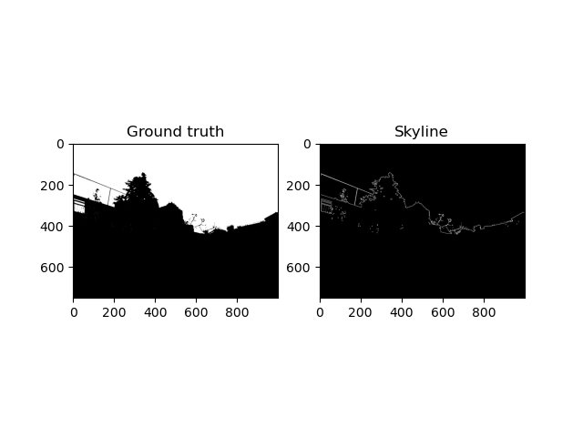
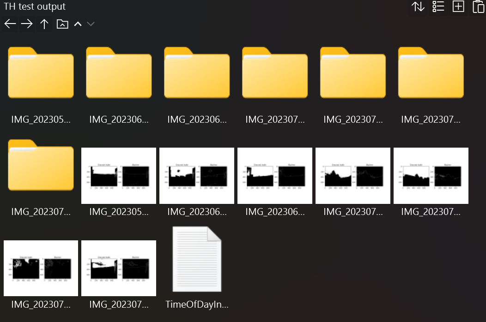

# sky-detection-algorithm
Brief description: A project to build an algorithm that is built upon the fundamental concept of digital image processing and computer vision to detect a sky region. <br> General theme of images it performs well on: outdoor urban cities


## 1. Requirements
The following are the sets of tools, libraries and setup environment used by the developer.
- spyder (from anaconda package)
- python language interpreter (version 3 family)
```python
# likely minimum version requirements of key components needed
python >= 3.1.x
# opencv library
cv2 >= 4.3.x
# other libraries used
matplotlib, re, glob, sys, os, shutil
```

<br><br>

---
## 2. Installation/setup instructions
If user do not have the tools and environment above, user may use alternatives that are already on user's machine (eg: VSC), provided user have the required libraries stated above. If user wish to install and use the above tools, please ensure the following.
```python
# if just freshly installed default anaconda, need to install opencv library
# open conda prompt terminal and run the following
pip install opencv-python
# after installing, user may launch a python interpreter window and run the following to check it is already installed
import cv2
print(cv2.__version__)
```

<br><br>

---
## 3. How to run program
### **NOTE (before running)**: 
Before actually clicking run on the program, ensure that user have created a **folder** in the same directory as the **python script file** (for convenience and less error risk) that holds all the images that the user wish to perform processing on. User may use any meaningful name he/she desires, no restriction. 

### **step 1**
When running the program, in the build terminal prompt (aka console), the program will prompt for the folder name where user stored the images he/she wish to run the algorithm on.
```python
# sample prompt given by the program
Which dataset do you wish to proceed? (please give only the dataset number as ur input)
Choice: 
# type the folder name (user's cursor will automatically be pointed after the "Choice:" as it is asking for user's input)
# if user's folder name has white spaces, type it out exactly as it is
```
### **step 2**
After entering the name of the folder, user may sit back and leave the program running in the background for some time (timespan varies according to computing power of the user's machine). Once done, the console should output a final message:
>Program finished executing...

<br><br>

---
## 4. Sample output

1. In the midst of running the program, when it is processing a certain image, the console will continuously update to show some information to the user
    - if image satisfies condition for processing
    - if program is to skip processing the image
    ```python
    Current file:  IMG_20230704_192628.jpg
    Processing queue  6
    Currently processing image: IMG_20230704_192628.jpg 


    Current file:  IMG_20230705_192516.jpg
    Processing queue  7
    Currently processing image: IMG_20230705_192516.jpg 


    Current file:  IMG_20230707_193359.jpg
    Skip processing this image!!!
    Conditions not suitable for processing


    Current file:  IMG_20230713_193751.jpg
    Skip processing this image!!!
    Conditions not suitable for processing

    ...
    ```

2. Right before the program finish executing, the console will display the information of each image whether taken during day or night time -> sample output below
```python
Processed information on image taken during what time of day -
1 .   IMG_20230530_192359.jpg   rgb   nighttime
2 .   IMG_20230530_192416.jpg   rgb   daytime
3 .   IMG_20230530_192537.jpg   rgb   nighttime
...
Program finished executing...
```

3. During the execution of the program in spyder, the program should pop-up a new window for every image that is being processed (done by `pyplot` library from `matplotlib`). A sample output of one such window when an image is done processing (from testing, the program is usually only able to show any actual content in each of these windows after the program is done executing) is shown below.

<!--  -->

<p align=center>
    
</p>


<br><br>

---
## 5. Program output files/folders
After finished running, in the same directory as the python script file, a new folder will be generated with the naming scheme `/<input folder name> output/`. This folder stores all the resulting output of mask/ground truth and skyline detected by the algorithm for the respective images. <br>
- Inside the **individual generated folders** are individual images of mask and skyline separately (in the event the user wishes to view with more details).<br>
- Images generated in the **output folder itself** are images generated by `pyplot` which consist of both the mask and skyline as a single image.<br>
- Inside the folder also consist of a **generated text file** that stores the information of all the images whether if they are taken during day or night time as processed by the algorithm respectively in a list.

<!--  -->

<p align=center>
    
</p>

<br><br>

---
## 6. Contributor
- Lo Tian Harng - 19080852
